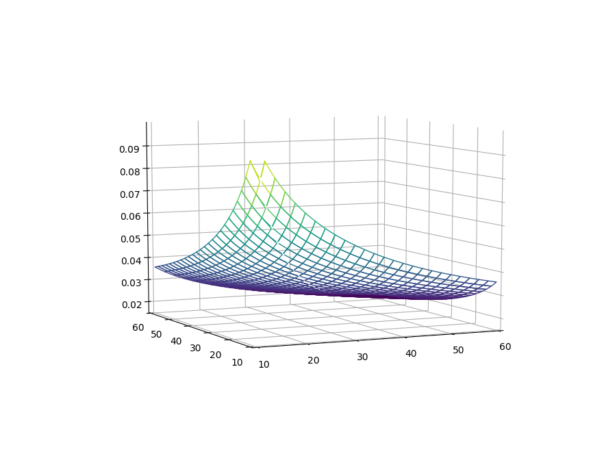

Extending SUSPECT
=================

Tutorial
--------

Pre requisites
~~~~~~~~~~~~~~

We recommend developing SUSPECT extensions in a separate virtual
environment than your main one.

From the root folder of your project, run::

  $ python3 -m venv myenv
  $ source myenv/bin/activate

After that, proceed to install SUSPECT in the newly created virtual
environment, see :ref:`installation`.

Task Overview
~~~~~~~~~~~~~

The objective of this tutorial is writing an extension for SUSPECT to detect
the convexity of the Reciprocal Log Mean Temperature equation:

.. math::

   \text{RecLMTD}^\beta (x, y) = \begin{cases}
   (\frac{\ln{(x/y)}}{x-y})^\beta & x \neq y\\
   \frac{1}{x^\beta} & x = y
   \end{cases}

With :math:`x,y > 0` and :math:`\beta \geq -1`. This expression `has
been proved`__ to be concave when :math:`-1 \leq \beta \leq 0` and
convex when :math:`\beta \geq 0`.

__ https://www.sciencedirect.com/science/article/pii/S0098135416302216

   Plot of RecLMTD when :math:`x \neq y`.

To test our implementation we use the following model in ``example.py``:

.. code-block:: python

    import pprint
    from suspect import detect_special_structure
    import pyomo.environ as aml

    model = aml.ConcreteModel()

    model.x = aml.Var(bounds=(0, None))
    model.y = aml.Var(bounds=(0, None))

    model.rec = aml.Constraint(expr=1/(model.x**3) <= 0)

    model.lmtd0 = aml.Constraint(
	expr=(aml.log(model.x/(model.y + 1e-6))/(model.x - model.y))**(-0.5) <= 0)

    info = detect_special_structure(model)

    pp = pprint.PrettyPrinter()
    pp.pprint(info.constraints)

Detector Implementation
~~~~~~~~~~~~~~~~~~~~~~~

At the root of your project directory, create a new directory
containing the source of the convexity detector::

  $ mkdir reclmtd

And write the detector in ``__init__.py``::

  $ $EDITOR reclmtd/__init__.py

In this way we can later on package the detector.

We start by importing SUSPECT classes used in the detector:

.. code-block:: python

    from suspect.ext import ConvexityDetector
    from suspect.convexity import Convexity
    from suspect.interfaces import Rule
    from suspect.expression import ExpressionType, UnaryFunctionType
    from suspect.math import almosteq, almostlte

After that we create a class for the detector:

.. code-block:: python

    class RectLMTDDetector(ConvexityDetector):
	"""Convexity detector for RecLMTD expressions."""
	def __init__(self, _problem):
	    super().__init__()

	def register_rules(self):
	    return [RecLMTDRule(), RecRule()]

The method ``register_rules`` returns a list of rules that are implemented
by this detector: the first to detect convexity when :math:`x \neq y` and
the second for the other cases.

The detector for :math:`1/x^\beta` is the simpler of the two so we
look at it first. To detect if the current expression ``expr`` matches
the expression we check the expression and its children types. In the
highlighted line we use the bounds value stored in ``ctx`` to check
whether the variable is non negative.

.. code-block:: python
   :emphasize-lines: 17

    class RecRule(Rule):
	root_expr = ExpressionType.Division

	def apply(self, expr, ctx):
	    num, den = expr.children
	    # numerator has to be 1.0
	    if not num.is_constant() or num.value != 1.0:
		return
	    # denominator has to be power with beta >= -1.0
	    if not den.expression_type == ExpressionType.Power:
		return
	    base, expo = den.children
	    if not expo.is_constant() or expo.value < -1.0:
		return
	    if not base.expression_type == ExpressionType.Variable:
		return
	    bounds = ctx.bounds(base)
	    if bounds.is_nonnegative():
		return _convexity_from_beta(expo.value)

The detector for the other case, when :math:`x \neq y`, is more
complex but follows the same principles. In the highlighted lines are
needed to handle the case when the modeler added a small
:math:`\epsilon` to the denominator to avoid a division by 0.

.. code-block:: python
   :emphasize-lines: 31-36

    class RecLMTDRule(Rule):
	root_expr = ExpressionType.Power

	def apply(self, expr, ctx):
	    base, expo = expr.children
	    # exponent has to be >= -1
	    if not expo.is_constant() or expo.value < -1:
		return
	    # base has to be division `ln(x/y) / (x-y)`
	    if not base.expression_type == ExpressionType.Division:
		return

	    num, den = base.children
	    # numerator must be log function
	    if not num.expression_type == ExpressionType.UnaryFunction:
		return
	    if not num.func_type == UnaryFunctionType.Log:
		return
	    # denominator must be linear expression of 2 variables
	    if not den.expression_type == ExpressionType.Linear:
		return
	    if not len(den.children) == 2:
		return

	    inner_div = num.children[0]

	    x, y = inner_div.children
	    # x and y must be variables
	    if not x.expression_type == ExpressionType.Variable:
		return
	    if y.expression_type == ExpressionType.Linear:
		# If we include a small eps then the denominator is a
		# linear expression.
		if len(y.children) != 1:
		    return
		y = y.children[0]
	    if not y.expression_type == ExpressionType.Variable:
		return

	    # Check x and y are in R_+
	    x_bounds = ctx.bounds(x)
	    y_bounds = ctx.bounds(y)
	    if not x_bounds.is_nonnegative() or not y_bounds.is_nonnegative():
		return

	    # check that linear expression is x - y
	    if x is den.children[0] and y is den.children[1]:
		if almosteq(den.coefficients[0], 1) and almosteq(den.coefficients[1], -1):
		    return _convexity_from_beta(expo.value)
	    elif x is den.children[1] and y is den.children[0]:
		if almosteq(den.coefficients[0], -1) and almosteq(den.coefficients[1], 1):
		    return _convexity_from_beta(expo.value)
	    # linear expr has 2 children but they are not the same
	    # variables as the one inside log(x/y)
	    return None

Finally we implement the function that returns convexity information
based on the value of :math:`\beta`.

.. code-block:: python

    def _convexity_from_beta(beta):
	if almosteq(beta, 0):
	    return Convexity.Linear
	elif almostlte(beta, 0) and almostlte(-1, beta):
	    return Convexity.Concave
	elif almostlte(0, beta):
	    return Convexity.Convex
	return Convexity.Unknown

Packaging
~~~~~~~~~

SUSPECT requires extensions to be packaged and registered as an entry
point. At the root of your project, add the following ``setup.py`` file

.. code-block:: python

    from setuptools import setup, find_packages

    setup(
	name='reclmtd_example',
	packages=find_packages(exclude=['tests']),
	entry_points={
	    'suspect.convexity_detection': ['reclmtd=reclmtd:RectLMTDDetector'],
	},
    )

Finally install the convexity detector::

  $ python setup.py install

If we run the example again we will see that the SUSPECT detects the
correct convexity information::

  $ python example.py
  {'lmtd0': {'convexity': <Convexity.Concave: 1>,
           'polynomial_degree': <PolynomialDegree(degree=None) at 0x7f10091cdd68>,
           'type': 'inequality'},
   'rec': {'convexity': <Convexity.Convex: 0>,
           'polynomial_degree': <PolynomialDegree(degree=None) at 0x7f10091cdcc0>,
           'type': 'inequality'}}
